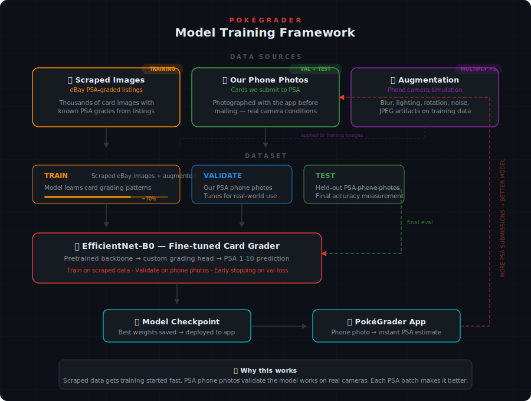

# PokéGrader

AI-powered Pokémon card condition grading from a phone camera photo. Estimates PSA 1–10 grades by analyzing centering, corners, edges, and surface quality.

> **Status:** Working prototype — card detection and centering analysis are live. Model training framework is built, data collection in progress.

## How It Works

Snap a photo of a card with your phone → the app detects the card, crops it, and predicts a PSA-style grade based on the same factors professional graders evaluate.

**What's working now:**
- Card detection and perspective correction from any background
- Real centering analysis with PSA-standard ratios (e.g., 55/45 left/right)
- Mobile-first camera UI
- Training pipeline and data augmentation framework

**What's next:**
- Model training once TAG scrape data reaches target volume
- Corner, edge, and surface condition analysis (using TAG sub-scores as labels)
- Defect detection trained on TAG's identified dings
- Composite grade prediction with confidence scores

## Training Strategy

The model trains on two data sources: scraped eBay images of PSA-graded cards and TAG Grading's detailed scoring reports. Validation and testing use our own phone photos submitted to PSA. Augmentation simulates real phone camera conditions (blur, lighting, noise) on the training data to close the gap between clean listing photos and real-world usage.

<p align="center">
  
</p>

| Split | Source | Purpose |
|-------|--------|---------|
| **Train** | Scraped eBay PSA listings + TAG reports + augmentation | Thousands of images with rich labels |
| **Validate** | Our phone photos → submitted to PSA | Reality check — does the model work on real phone cameras? |
| **Test** | Held-out phone photos with PSA grades | Final accuracy measurement, never seen during training |

The feedback loop: as we submit more cards to PSA, the validation and test sets grow, and the model gets retrained with better real-world signal.

## Data Collection

### Why TAG Grading

[TAG Grading](https://my.taggrading.com/) provides three layers of ground truth that make it exceptionally valuable for model training — far richer than a simple PSA 1–10 label:

**TAG Score (0–1000)** — A continuous score that maps to the final 1–10 grade. Two cards can both be a "10 GEM MINT" but score 985 vs 970. This turns what would be a classification problem into a regression problem, giving the model gradient signal even from small differences between similar cards.

**Per-Feature Sub-Scores** — Fray, Fill, and Angle scores (each 0–1000) for every corner and edge, front and back. These enable training specialized sub-models for each grading factor with their own granular labels.

**Identified Defects** — Specific defect instances with notable grade impact: location, category (SURFACE, EDGE, CORNER), and type (INK DEFECT, etc.), each with a close-up image. Essentially free defect-detection annotation.

### Data Strategy

**Prioritize grade diversity, not card popularity.** A dinged corner looks the same on a Charizard as it does on a Caterpie. The model needs to learn grading features (edge whitening, corner fraying, surface scratches), not which Pokémon is on the card. Biasing toward popular cards risks overfitting to specific layouts and color patterns.

**Prioritize set diversity.** Different eras have different border styles, holo patterns, print quality, and card stock. Training across multiple sets (Base Set, modern, Japanese, etc.) forces the model to generalize the actual grading signals rather than memorizing set-specific visual patterns.

**Card-specific distribution can wait.** If we later add card identification or fine-tune based on user feedback in production, popularity weighting becomes relevant. But for training the grading model itself, grading features are card-agnostic.

| Priority | What | Why |
|----------|------|-----|
| 🔴 High | Grade distribution (spread across 1–10 and 0–1000) | Model needs examples of every condition level |
| 🔴 High | Set/era diversity (Base Set, modern, Japanese, etc.) | Generalize across border styles and print quality |
| 🟡 Medium | Defect type coverage (ink, surface, corner wear, etc.) | Defect detection needs variety |
| 🟢 Low | Card popularity (Charizard vs Caterpie) | Grading features are card-agnostic |

## Tech Stack

- **Backend:** Python, FastAPI, OpenCV, PyTorch
- **Frontend:** HTML/JS with browser Camera API (mobile-first)
- **CV Pipeline:** Card detection, perspective correction, border analysis
- **Model:** EfficientNet-B0 fine-tuned on PSA-graded card images
- **Augmentation:** Phone camera simulation (blur, lighting, rotation, JPEG artifacts, noise)

## Quick Start

```bash
# Install dependencies
pip install -r requirements.txt

# Run the app
python -m src.api.app
```

Open `http://localhost:8000` on your phone (same network) to start grading.

## Project Structure

```
pokegrader/
├── src/
│   ├── api/
│   │   └── app.py              # FastAPI server
│   ├── model/
│   │   ├── grader.py           # EfficientNet multi-head model
│   │   └── train.py            # Training loop
│   └── utils/
│       ├── card_detector.py    # Card detection & perspective correction
│       ├── centering.py        # Centering analysis (algorithmic)
│       ├── grading.py          # Composite grade calculation
│       ├── preprocessing.py    # Image preprocessing pipeline
│       ├── pipeline.py         # Data pipeline (capture → PSA → train)
│       └── augmentation.py     # Phone camera augmentation
├── configs/
│   └── default.yaml            # Model & grading config
├── data/
│   ├── raw/                    # Scraped training images
│   ├── processed/              # Cropped & organized
│   └── augmented/              # Augmented training sets
├── web/
│   ├── static/
│   └── templates/
└── tests/
```

## Grading Factors

| Factor | Weight | Method | Training Labels | Status |
|--------|--------|--------|-----------------|--------|
| Centering | 20% | Algorithmic (border analysis) | TAG centering percentages | ✅ Working |
| Corners | 25% | CNN (fine-tuned EfficientNet) | TAG Fray/Fill/Angle per corner (0–1000) | 🔄 Collecting data |
| Edges | 25% | CNN (fine-tuned EfficientNet) | TAG Fray/Fill per edge (0–1000) | 🔄 Collecting data |
| Surface | 30% | CNN (fine-tuned EfficientNet) | TAG defect annotations + overall score | 🔄 Collecting data |

## Disclaimer

Estimated grades for personal reference only. Not affiliated with PSA, BGS, CGC, or any official grading service.