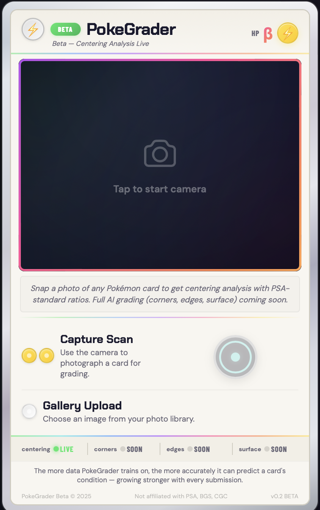

# PokéGrader

AI-powered Pokémon card condition grading from a phone camera photo. Estimates PSA 1–10 grades by analyzing centering, corners, edges, and surface quality.

> **Status:** Live beta — card detection, centering analysis, and initial AI grading model deployed. Model retraining with balanced dataset in progress.

## 🔴 Try It Now

**[Launch PokéGrader Beta →](https://huggingface.co/spaces/kevwill/pokegrader)**

Open on your phone, snap a photo of any Pokémon card, and get an instant centering analysis with PSA-standard ratios. Works on any mobile browser — no app install needed.

<p align="center">
  
</p>

## How It Works

Snap a photo of a card with your phone → the app detects the card, crops it, and predicts a PSA-style grade based on the same factors professional graders evaluate.

**What's live now:**
- Card detection and perspective correction from any background
- Real centering analysis with PSA-standard ratios (e.g., 55/45 left/right)
- Initial AI grading model (EfficientNet-B0 + metadata fusion, 72% accuracy within 1 grade)
- Mobile-first camera UI with photo quality validation (blur, exposure, glare detection)
- Deployed on Hugging Face Spaces — accessible from any phone

**What's next:**
- Retraining with balanced dataset (~530 additional low-grade cards targeting grades 4 and 7)
- Defect and ding detection from full card images
- Per-factor breakdowns (corners, edges, surface) with confidence scores

## Architecture: Multimodal Grading Pipeline

PokéGrader uses a multimodal pipeline that mirrors how a human grader evaluates a card — combining visual analysis with structured measurements rather than relying on a single end-to-end model.

```
┌─────────────────────────────────────────────────────────┐
│                     QUERY (Input)                       │
│  Raw photo → quality gate → card detection → crop       │
└─────────────────────┬───────────────────────────────────┘
                      │
┌─────────────────────▼───────────────────────────────────┐
│                   ENCODER (Features)                    │
│  EfficientNet-B0 backbone produces 1280-dim visual      │
│  features from the cropped card image                   │
└─────────────────────┬───────────────────────────────────┘
                      │
┌─────────────────────▼───────────────────────────────────┐
│              FUSION (Visual + Structured)                │
│                                                         │
│  ┌──────────────┐  ┌──────────────┐  ┌──────────────┐  │
│  │  Centering   │  │   Defect     │  │   Metadata   │  │
│  │ (algorithmic)│  │   Counts     │  │   Features   │  │
│  └──────┬───────┘  └──────┬───────┘  └──────┬───────┘  │
│         │                 │                 │           │
│  Visual features (1280) + aux features (11) → MLP head  │
│  → combined [1312-dim] → FC layers → grade prediction   │
└─────────────────────┬───────────────────────────────────┘
                      │
┌─────────────────────▼───────────────────────────────────┐
│                   OUTPUT (Grade)                        │
│  Continuous grade (1.0–10.0) → rounded PSA grade        │
│  + confidence score + centering breakdown               │
└─────────────────────────────────────────────────────────┘
```

### Why This Architecture

Early data analysis revealed that TAG Grading's per-feature sub-scores (Fray, Fill, Angle for each corner and edge) have virtually no variance across grade levels — a grade 1 card and a grade 10 card both score 994–1000 on corners and edges. This made the original plan of training separate CNN sub-models per grading factor unviable.

What *does* carry strong signal: the overall TAG score (0–1000), defect counts and types, centering measurements, and the visual appearance of the full card image. The multimodal pipeline exploits all of these by combining a vision backbone with structured data fusion, rather than asking a single model to learn everything from pixels alone.

### Initial Model Performance

The v1 model (EfficientNet-B0 + 11-dim auxiliary features, trained for 27 epochs on ~1,200 cards):

| Metric | Value |
|--------|-------|
| Mean Absolute Error | 0.94 grades |
| Within 1 grade | 71.7% |
| Within 0.5 grade | 46.6% |
| Exact grade match | 39.3% |

The primary limitation is class imbalance — the training set skews heavily toward grades 8–10. Retraining with a balanced dataset is the next priority.

## Training Strategy

The model trains on two data sources: scraped eBay images of PSA-graded cards and TAG Grading's scoring reports. Validation and testing use our own phone photos submitted to PSA. Augmentation simulates real phone camera conditions (blur, lighting, noise) on the training data to close the gap between clean listing photos and real-world usage.

<p align="center">
  
</p>

| Split | Source | Purpose |
|-------|--------|---------|
| **Train** | Scraped eBay PSA listings + TAG reports + augmentation | Thousands of images with rich labels |
| **Validate** | Our phone photos → submitted to PSA | Reality check — does the model work on real phone cameras? |
| **Test** | Held-out phone photos with PSA grades | Final accuracy measurement, never seen during training |

The feedback loop: as we submit more cards to PSA, the validation and test sets grow, and the model gets retrained with better real-world signal.

## Data Collection

### TAG Grading — What's Useful (and What Isn't)

[TAG Grading](https://my.taggrading.com/) provides detailed scoring data for over 591,000 graded Pokémon cards. Through data analysis, we identified which signals are actually useful for training:

**✅ TAG Score (0–1000)** — A continuous score mapping to the final 1–10 grade. Turns classification into regression, giving gradient signal even between similar cards (e.g., two "10 GEM MINT" cards scoring 985 vs 970).

**✅ Identified Defects** — Specific defect instances with location, category (SURFACE, EDGE, CORNER), type (INK DEFECT, etc.), and close-up images. Defect counts correlate strongly with grade — grade 10s have 0–1 defects, grade 6s have 4+. This is essentially free defect-detection annotation.

**✅ Full Card Images** — 1,200+ card images across the grade spectrum with known grades, usable as direct training data for the vision encoder.

**❌ Per-Feature Sub-Scores** — Fray, Fill, and Angle scores (each 0–1000) for corners and edges show virtually no variance across grades. A grade 1 card scores 994–1000 on corners, same as a grade 10. Many cards have these fields completely empty. These sub-scores are **not usable** as independent training labels.

This finding drove the architectural pivot from separate per-factor CNNs to the unified multimodal pipeline described above.

### Data Strategy

**Prioritize grade diversity, not card popularity.** A dinged corner looks the same on a Charizard as it does on a Caterpie. The model needs to learn grading features (edge whitening, corner fraying, surface scratches), not which Pokémon is on the card. Biasing toward popular cards risks overfitting to specific layouts and color patterns.

**Prioritize set diversity.** Different eras have different border styles, holo patterns, print quality, and card stock. Training across multiple sets (Base Set, modern, Japanese, etc.) forces the model to generalize the actual grading signals rather than memorizing set-specific visual patterns.

**Address class imbalance.** The current dataset skews heavily toward grades 8–10. Active collection of ~530 additional low-grade cards (especially grades 4 and 7) is in progress to balance the training distribution.

| Priority | What | Why |
|----------|------|-----|
| 🔴 High | Grade distribution (spread across 1–10 and 0–1000) | Model needs examples of every condition level |
| 🔴 High | Set/era diversity (Base Set, modern, Japanese, etc.) | Generalize across border styles and print quality |
| 🔴 High | Class balance (low-grade card collection) | Prevent model from defaulting to high grades |
| 🟡 Medium | Defect type coverage (ink, surface, corner wear, etc.) | Defect detection needs variety |
| 🟢 Low | Card popularity (Charizard vs Caterpie) | Grading features are card-agnostic |

## Tech Stack

- **Backend:** Python, FastAPI, OpenCV, PyTorch
- **Frontend:** HTML/JS with browser Camera API (mobile-first)
- **CV Pipeline:** Card detection, perspective correction, border analysis, photo quality validation
- **Model:** EfficientNet-B0 backbone + auxiliary feature MLP (11-dim metadata fusion)
- **Centering:** Algorithmic (OpenCV border analysis) — no model needed
- **Augmentation:** Phone camera simulation (blur, lighting, rotation, JPEG artifacts, noise)
- **Deployment:** Docker on Hugging Face Spaces

## Quick Start

### Try the live beta

**[huggingface.co/spaces/kevwill/pokegrader](https://huggingface.co/spaces/kevwill/pokegrader)**

### Run locally

```bash
# Install dependencies
pip install -r requirements.txt

# Run the app
python -m src.api.app
```

Open `http://localhost:8000` on your phone (same network) to start grading.

## Project Structure

```
pokegrader/
├── src/
│   ├── api/
│   │   └── app.py              # FastAPI server
│   ├── model/
│   │   ├── grader.py           # EfficientNet-B0 + aux feature fusion model
│   │   ├── sub_model.py        # Corner/edge sub-score models (experimental)
│   │   ├── train.py            # Training loop (eBay data)
│   │   └── train_tag.py        # Training loop (TAG data)
│   └── utils/
│       ├── card_detector.py    # Card detection & perspective correction
│       ├── centering.py        # Centering analysis (algorithmic)
│       ├── grading.py          # Composite grade calculation
│       ├── preprocessing.py    # Image preprocessing & quality validation
│       ├── pipeline.py         # Data pipeline (capture → PSA → train)
│       └── augmentation.py     # Phone camera augmentation
├── configs/
│   └── default.yaml            # Model & grading config
├── data/
│   ├── raw/                    # Scraped training images
│   ├── processed/              # Cropped & organized
│   ├── augmented/              # Augmented training sets
│   └── models/                 # Trained model checkpoints
├── web/
│   └── templates/
│       └── index.html          # Mobile-first camera UI
└── tests/
```

## Grading Factors

| Factor | Method | Signal Source | Status |
|--------|--------|--------------|--------|
| Centering | Algorithmic (OpenCV border analysis) | TAG centering measurements | ✅ Live |
| Overall Grade | EfficientNet-B0 + metadata fusion | Full card images + TAG scores + defect counts | ✅ Beta |
| Corners | Vision encoder (planned) | Full card images + defect metadata | 🔄 Next |
| Edges | Vision encoder (planned) | Full card images + defect metadata | 🔄 Next |
| Surface | Vision encoder (planned) | Full card images + defect annotations | 🔄 Next |

> **Note:** The initial model predicts a holistic grade from the full card image + structured metadata rather than scoring individual factors separately, since TAG's per-feature sub-scores lack the variance needed for independent training.

## Disclaimer

Estimated grades for personal reference only. Not affiliated with PSA, BGS, CGC, or any official grading service.